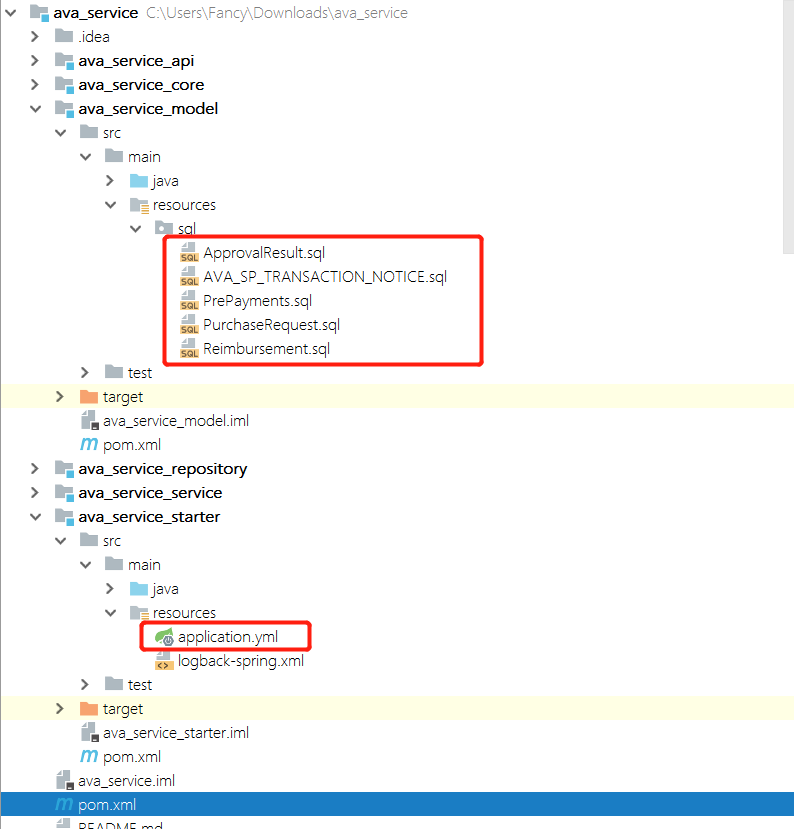

# java 后端服务代码生成器

### 相关环境与框架

```java
jdk 1.8
spring boot 2.1.1
freemarker
thymeleaf
```

### 项目简介

模块名称|简介
-------|----
codegen-api| api接口，提供restful风格api供外部/前端调用
codegen-core| 核心模块，主要包括常量，配置，工具类等
codegen-model| 领域模块层
codegen-service|业务逻辑层
codegen-starter|启动项目
codegen-web| web UI层


### 启动运行

先在父项目中执行`install`命令，然后进入启动模块，执行`package`命令。

启动后，在浏览器中输入：`http://localhost:8080/project/`


+ 1、*创建项目前需先上传数据结构文件*

+ 2、上传完成后输入项目名称，选择项目类型，然后点击`创建项目`，然后下载项目压缩包。

### 项目类型说明

+ DAHUPT_APPLICATION

Dahupt应用类型服务，应用场景类型服务

+ DAHUPT_SERVICE

Dahupt基础服务单元

+ SBO_PROJECT

SBO相关项目，设计DI操作

+ SIMPLE_SERVICE

简单服务，存粹的CURD类型服务

### 项目简介

下载项目完成解压后，即可得到类似下图的多模块项目结构。



待项目maven依赖下载完成后，需完成以下操作：

+ 执行`model`模块下的sql脚本

+ 修改`starter`模块下的数据库相关配置 


