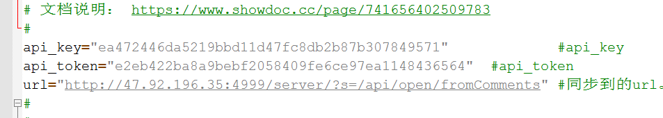

# java 后端服务代码生成器

### 相关环境与框架

```java
jdk 1.8
spring boot 2.1.1
freemarker
thymeleaf
```

### 项目简介

模块名称|简介
-------|----
codegen-api| api接口，提供restful风格api供外部/前端调用
codegen-core| 核心模块，主要包括常量，配置，工具类等
codegen-model| 领域模块层
codegen-service|业务逻辑层
codegen-starter|启动项目
codegen-web| web UI层


### 启动运行

先在父项目中执行`install`命令，然后进入启动模块，执行`package`命令。

启动后，在浏览器中输入：`http://localhost:8080/project/`


+ 1、*创建项目前需先上传数据结构文件*

+ 2、上传完成后输入项目名称，选择项目类型，然后点击`创建项目`，然后下载项目压缩包。

### 项目类型说明

+ DAHUPT_APPLICATION

Dahupt应用类型服务，应用场景类型服务

+ DAHUPT_SERVICE

Dahupt基础服务单元

+ SBO_PROJECT

SBO相关项目，设计DI操作

+ SIMPLE_SERVICE

简单服务，存粹的CURD类型服务

### 创建项目简介

下载项目完成解压后，即可得到类似下图的多模块项目结构。


待项目maven依赖下载完成后，需完成以下操作：

+ 执行`model`模块下的sql脚本

+ 修改`starter`模块下的数据库相关配置

### 接口文档

[接口文档管理平台](http://47.92.196.35:4999/web/#/)

项目创建后，在`api_doc`目录下会创建如下图所示的接口文档相关文件(后缀为api的表示接口文档信息，shell脚本主要将本目录下所有的api文件同步至接口管理平台)。


***注意：参数注释只有四列，并以空格分隔，所以各列的内容不要有空格。***

shell脚本文件的`api_key`和`api_token`需要与平台中此项目的`api_key`和`api_token`一致。



双击脚本执行。


### 版本相关

|codegen分支|edi-freamwork版本|说明|
|--|--|--|
|2.0.0.01|1.0.0.02|id为Long类型（雪花算法），lineId为integer类型|
|2.0.1.01|1.0.1.02|id、lineId都为String类型（UUID）|
|2.0.0|2.0.0|id、lineId都为Long类型，为最新支持的版本，将不再对以前分支版本进行维护|

### 项目功能计划

+ 支持dahupt_application服务项目创建

+ 支持dahupt_service服务项目创建

+ 支持sbo_service服务项目创建 （已实现）

+ 支持simple_service服务项目创建

+ 支持rpc协议

+ 支持soap协议

+ 仓储层增删改查功能（已实现）

+ 接口文件导出

+ 支持标准SBO对象DI生成

+ 支持标准SBO对象Service Layer生成


